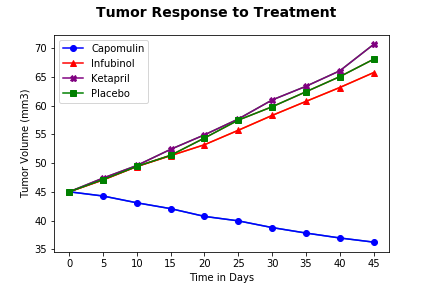

# Week 5 MatplotlibChallenge
By A. Rijpkema on 11/9/2019

These weeks challenge encompassed analyzing tumor and metastatic site growth over a 45 day period in a group of mice that were given 9 different kind of drugs or a placebo.

Tumor growth was analyzed, both in mm3 and percentages, for 3 kinds of drugs and the placebo.
The same was done for Metastatic Site data. Thirdly, the survival rate was looked at.

Results were plotted in 3 charts:
Tumor growth (in mm3) per Treatment
Metastatic Spread per Treament
Survival rate per Treatment.

Lastly, total percentage tumor change was displayed in a bar chart.

